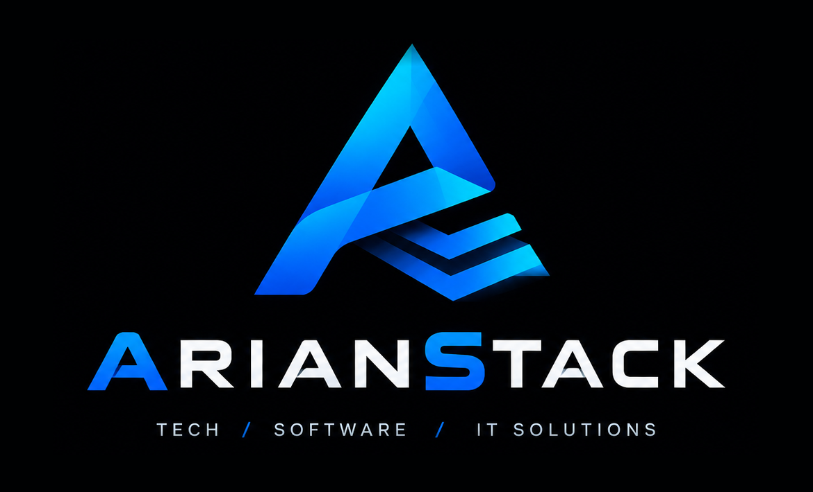
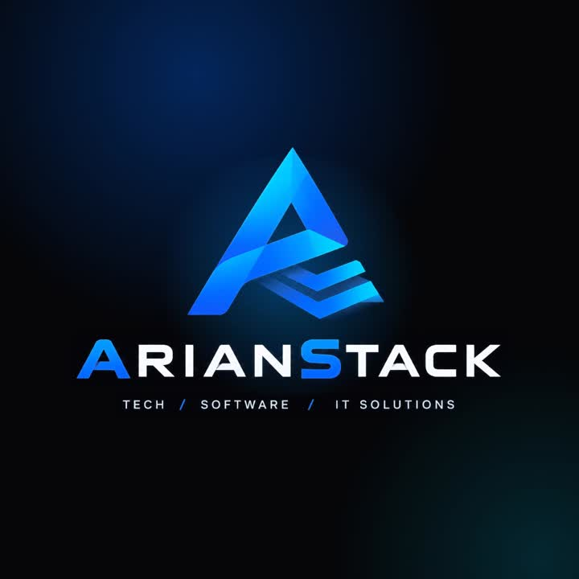
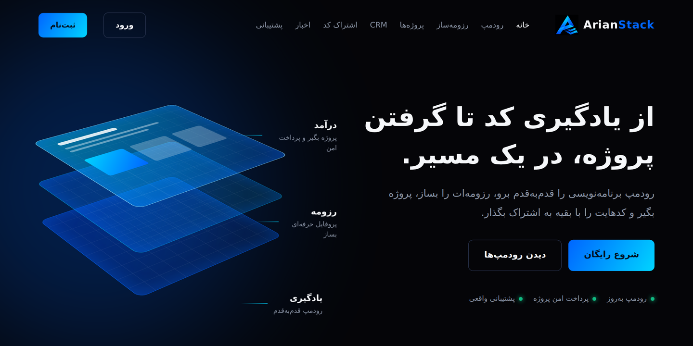
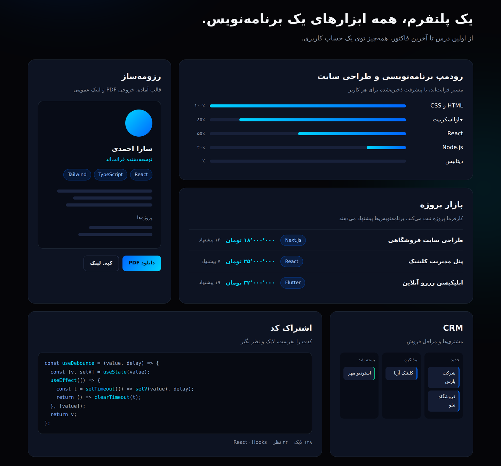
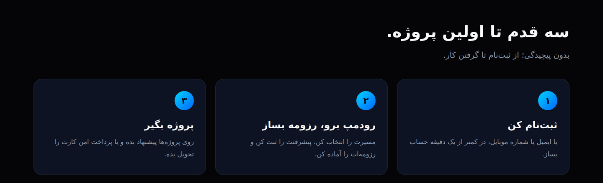
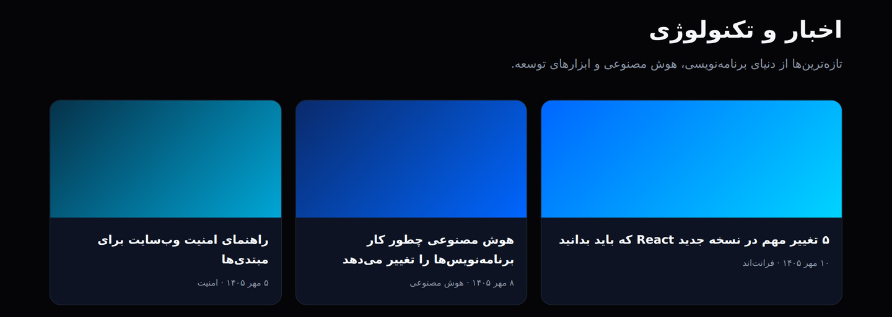
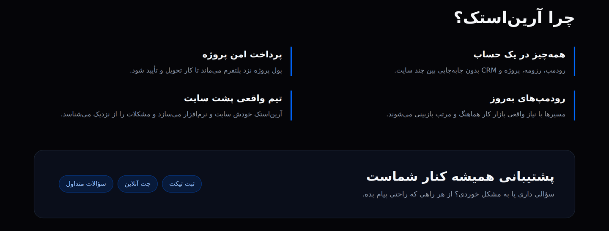
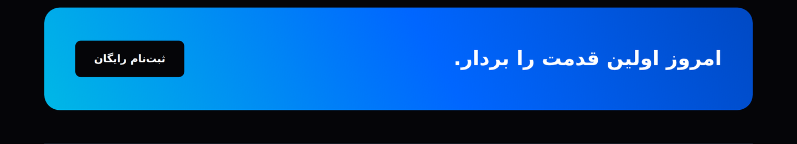
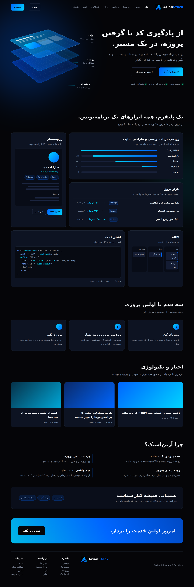

<div align="center">



<br />

**From learning code to landing real projects, all in one path.**

A modern technology and IT platform that supports developers throughout their entire journey: learning, building, sharing, and working professionally.

<br />

[](https://arianstack.ir)
[](https://react.dev)
[](https://vitejs.dev)
[](https://tailwindcss.com)
[](./LICENSE)

</div>

---

## Brand Introduction Video

<div align="center">

[](./docs/media/arianstack-promo.mp4)

▶️ **Click the image to watch the ArianStack promo video**

</div>

---

## Table of Contents

- [About the Project](#about-the-project)
- [Preview](#preview)
- [Key Features](#key-features)
- [Tech Stack](#tech-stack)
- [Project Structure](#project-structure)
- [Getting Started](#getting-started)
- [Available Scripts](#available-scripts)
- [Deployment](#deployment)
- [Roadmap](#roadmap)
- [Contributing](#contributing)
- [License](#license)
- [Author](#author)

---

## About the Project

**ArianStack** is a powerful platform in the world of technology, IT, and web design. It brings together everything a developer needs in one unified ecosystem:

> **Learn → Build → Share → Get Hired**

From a structured programming roadmap and a professional resume builder, to a project marketplace, a built-in CRM, and a code-sharing community, ArianStack accompanies you from your first line of code to your first real-world project.

The interface is fully **Persian (RTL)**, dark-themed, responsive, and designed with a clean, modern visual identity.

---

## Preview

### Landing Page

<div align="center">
  
</div>

### One Platform, All the Tools of a Developer

Roadmap, resume builder, project marketplace, CRM, and code sharing, all inside a single account.

<div align="center">
  
</div>

### Three Steps to Your First Project

<div align="center">
  
</div>

### News & Technology

<div align="center">
  
</div>

### Why ArianStack & Support

<div align="center">
  
</div>

### Call to Action

<div align="center">
  
</div>

<details>
<summary><b>View full-page screenshot</b></summary>
<br />
<div align="center">
  
</div>
</details>

---

## Key Features

| | Feature | Description |
|---|---|---|
| 🗺️ | **Programming & Web Design Roadmap** | A step-by-step learning path (HTML & CSS, JavaScript, React, Node.js, Databases) with progress saved for every user. |
| 📄 | **Resume Builder** | Ready-made templates with PDF export and a public shareable link. |
| 🚀 | **Project Marketplace** | Employers post projects, developers send proposals, and payments are held securely until delivery. |
| 👥 | **CRM** | Manage customers and sales stages (New → Negotiation → Closed) on a simple board. |
| 🔗 | **Code Sharing** | Post your code, collect likes and comments, and learn from the community. |
| 📰 | **News & Technology** | Latest news from the world of programming, AI, and developer tools. |
| 💬 | **Real Support** | Ticket, live chat, and FAQ, always by your side. |

### Platform Highlights

- 🌙 Modern dark interface with a distinctive blue gradient identity
- 🔤 Full Persian (RTL) support with the Vazirmatn font
- 📱 Responsive layout for mobile, tablet, and desktop
- ⚡ Fast builds and hot reload powered by Vite
- 🧩 Clean, modular React components

---

## Tech Stack

| Category | Technology |
|---|---|
| **Framework** | [React](https://react.dev) |
| **Build Tool** | [Vite](https://vitejs.dev) |
| **Styling** | [Tailwind CSS](https://tailwindcss.com) |
| **Typography** | [Vazirmatn](https://github.com/rastikerdar/vazirmatn) |
| **Language** | JavaScript (ES6+), JSX |
| **Version Control** | Git & GitHub |

---

## Project Structure

```bash
arianstack/
├── docs/                    # README assets (screenshots, brand, video)
│   ├── brand/
│   ├── media/
│   └── screenshots/
├── public/                  # Static assets (logos, favicon, icons)
├── src/
│   ├── components/          # Reusable UI components
│   │   ├── Header.jsx
│   │   ├── Hero.jsx
│   │   ├── Features.jsx
│   │   ├── Why.jsx
│   │   ├── News.jsx
│   │   ├── CtaFooter.jsx
│   │   └── ThemeToggle.jsx
│   ├── hooks/               # Custom React hooks
│   ├── App.jsx              # Root component
│   ├── main.jsx             # Application entry point
│   ├── index.css            # Global styles
│   └── ui.js                # UI helpers
├── index.html
├── vite.config.js
├── package.json
└── README.md
```

---

## Getting Started

### Prerequisites

- [Node.js](https://nodejs.org) 18 or higher
- npm (included with Node.js)

### Installation

```bash
# 1. Clone the repository
git clone https://github.com/arianmi7/arianstack.git

# 2. Move into the project folder
cd arianstack

# 3. Install dependencies
npm install

# 4. Start the development server
npm run dev
```

The app will be available at `http://localhost:5173`.

---

## Available Scripts

| Command | Description |
|---|---|
| `npm run dev` | Starts the development server with hot reload |
| `npm run build` | Creates an optimized production build in `dist/` |
| `npm run preview` | Previews the production build locally |

---

## Deployment

ArianStack is a static site and can be deployed anywhere.

```bash
npm run build
```

Then upload the generated `dist/` folder to any of these:

- [Vercel](https://vercel.com)
- [Netlify](https://netlify.com)
- [GitHub Pages](https://pages.github.com)
- Any static host or VPS (Nginx / Apache)

---

## Roadmap

- [x] Responsive landing page
- [x] Persian (RTL) typography
- [x] Brand identity and promo video
- [ ] Authentication (sign up and log in)
- [ ] Interactive learning roadmaps with saved progress
- [ ] Resume Builder with PDF export
- [ ] Project marketplace with secure payments
- [ ] CRM board
- [ ] Code sharing with likes and comments

---

## Contributing

Contributions, issues, and feature requests are welcome.

1. Fork the repository
2. Create your feature branch: `git checkout -b feature/amazing-feature`
3. Commit your changes: `git commit -m "Add amazing feature"`
4. Push to the branch: `git push origin feature/amazing-feature`
5. Open a Pull Request

---

## License

Distributed under the **MIT License**. See [LICENSE](./LICENSE) for more information.

---

## Author

<div align="center">

**Arian Miraki**

Creator of ArianStack · Built with Tailwind CSS

[](https://github.com/arianmi7)

<br />

⭐ If you like this project, please give it a star!

</div>
